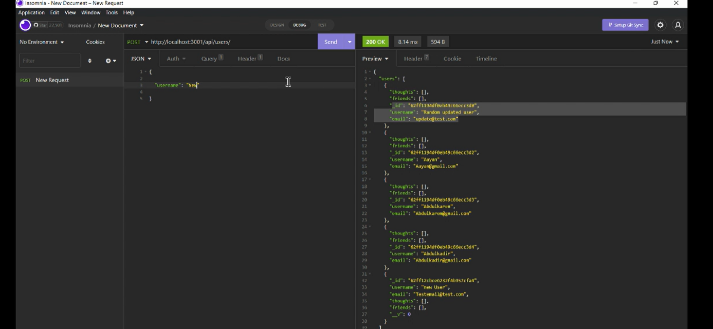

# API-Social-Networking
 
<div id="top"></div>

<br />
<div align="center">


<h3 align="center">API: Social Networking</h3>

  <p align="center">
    MongoDB-based API for Social Networking Application
    <br />
  </p>
</div>

<details>
  <summary>Table of Contents</summary>
  <ol>
    <li><a href="#about-the-project">About The Project</a></li>
    <li><a href="#tools">Tools</a></li>
    <li><a href="#instructions">Instructions</a></li>
    <li><a href="#usage">Usage</a></li>
    <li><a href="#license">License</a></li>
    <li><a href="#contact">Contact</a></li>
  </ol>
</details>

## About The Project

The motivation behind this project is to create a MongoDB-based API for a social networking application. The API utilizes Mongoose to connect to and seed a MongoDB database. Once this database is created, the API utilizes the Node.js Express module to initialize a local server which enables API routes to pull, update and delete data from the database. 

<p align="right">(<a href="#top">back to top</a>)</p>

### Tools

* JavaScript
* MongoDB
* Node.js


<p align="right">(<a href="#top">back to top</a>)</p>

## Usage


Please follow the instructions below to install and use the API: 

- You will need to download the repository files to your local machine. 
- Type the following commands into the command prompt within the root directory of the repository to download the Node.js modules:

```
npm install
``` 

Once the Node.js modules are installed, you can run the seed data by typing the following commands into the terminal:

```
optional: npm run seed
```

- Type the following into the command prompt to run the API.
```
npm start
```
- Once you have initiated the applicaiton, your MongoDB-based database will be active on your local server which can then be updated using API post, put or delete routes. 

See below for demonstration of the application

[](https://drive.google.com/file/d/1pRx1DLjKL2iRiSLSGYwMjeF4r4qCgkDR/view?usp=sharing)

<p align="right">(<a href="#top">back to top</a>)</p>

## License

[](https://opensource.org/licenses/MIT)
<br>Distributed under the MIT License. See `LICENSE.txt` for more information.

<p align="right">(<a href="#top">back to top</a>)</p>

## Contact

Henry Nguyen -  hln11244@gmail.com

Repository Link: [https://github.com/henry11244/API-Social-Networking](https://github.com/henry11244/API-Social-Networking)

linkedIn: https://www.linkedin.com/in/henry11244/

<p align="right">(<a href="#top">back to top</a>)</p>


